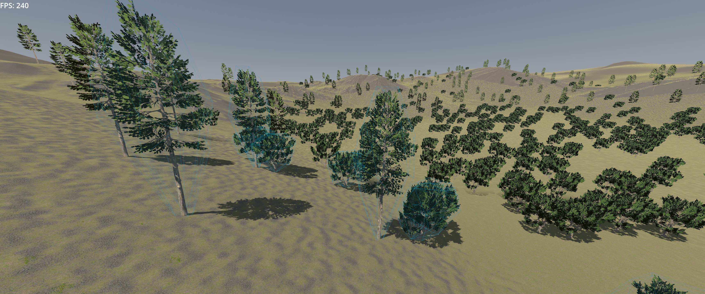
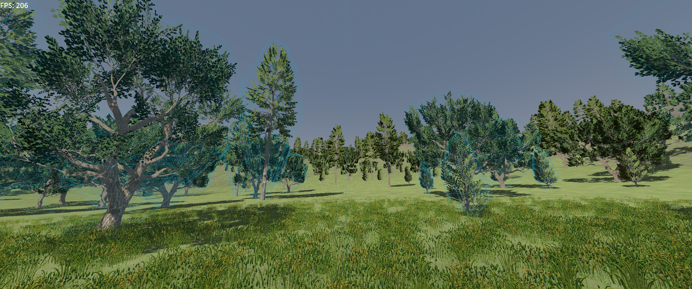

# Foliage3D

Foliage3D is a GDExtension addon for [Godot 4](https://godotengine.org) that procedurally places foliage (trees, bushes, grass, flowers, rocks...) across a large open world. It works with [Terrain3D](https://github.com/TokisanGames/Terrain3D): foliage sits on the terrain's height, aligns to its normals, skips holes, and can be limited to specific terrain textures.





## Features

- **Large worlds.** The world is split into a quad tree of square chunks. Chunks near the camera are small and detailed. Chunks further away are larger and coarser. The tree splits and merges chunks as the camera moves, based on how large each chunk looks from the camera.
- **LOD out of the box.** Each `FoliageAsset` has a list of meshes, one per level of detail, plus a `lod_map` that picks which mesh each chunk LOD uses. Far away, an asset can switch to a cheap impostor or disappear entirely.
- **Draw call optimization.** All instances of one mesh in a chunk are drawn as a single `MultiMesh`, so a chunk costs about one draw call per mesh, however many instances it holds.
- **Interactive foliage up close.** An asset can have a `scene`. In the closest chunks, instances are swapped for real instances of that scene (with collisions, scripts, and so on). The swap is spread over several frames.
- **Multithreaded and fully asynchronous.** Chunks are generated on worker threads and never block the main thread. A chunk keeps showing until its more detailed replacements are ready, so there are no holes while new chunks are built. Chunks that become obsolete mid-build are cancelled.
- **Deterministic.** Placement is seeded by world position, so a given spot always gets the same foliage, at every LOD and regardless of which chunk generates it.
- **Placement rules.** `FoliageCollectionBasic` controls density with terrain textures, height curves, slope curves and a noise. Assets get random yaw, pitch and scale, and can be tilted toward the terrain normal.
- **Extensible.** Subclass `FoliageLayer` (in a script or in GD++) and override `_place` to write your own placement logic.

## Concepts

| Class | Kind | Purpose |
|---|---|---|
| `FoliagePartition` | Node | The quad tree. Points at a `Terrain3D` node and manages chunks for each of its child layers. |
| `FoliageLayer` | Node | One layer of foliage covering the world. It defines a jittered lattice of candidate points (`lattice_spacing`, `randomness`, `keep`) and the farthest LOD it shows (`hide_lod`). Override `_place` to choose assets. |
| `FoliageLayerBasic` | Node | A ready-made `FoliageLayer` that places assets from a list of `FoliageCollectionBasic`s. |
| `FoliageCollectionBasic` | Resource | A weighted set of assets plus density rules (textures, height, slope, noise). |
| `FoliageAsset` | Resource | A single placeable thing: its LOD meshes, `lod_map`, shadow setting, optional interactive `scene`, and transform randomization. |
| `FoliagePlacement` | Object | The data a layer's `_place` works on: candidate points with their transforms, normals and terrain textures. |

All classes come with in-editor documentation. Search for them in Godot's help.

## GD++

Foliage3D is written in [GD++](https://github.com/caphindsight/gdpp). GD++ is a language with GDScript-style declarations (`class_name`, `@export`, `func`, signals) and C++ function bodies. It compiles to a native GDExtension, so you write no godot-cpp boilerplate: GD++ generates the headers, method bindings, property getters/setters and class registration. It also has language support for asynchronous tasks (`@onthread`, `Async<T>`, `cancel`, `claim`, `is_done`), which Foliage3D uses to build chunks on worker threads.

Foliage3D is partly meant as a first demonstration of GD++ on a fairly real project. The sources are in [`addons/foliage_3d/src`](addons/foliage_3d/src). Terrain3D is a separate GDExtension, and [`terrain_3d.gd++`](addons/foliage_3d/src/terrain_3d.gd++) shows how GD++ binds to another extension's classes at runtime.

GitHub can't highlight GD++, so [`readme/index.md`](readme/index.md) shows each source file highlighted.

## Building

### Prerequisites

1. Godot 4.7.
2. GD++. Build and install it as described in its [README](https://github.com/caphindsight/gdpp):
   ```sh
   git clone https://github.com/caphindsight/gdpp && cd gdpp
   make && sudo make install
   ```
3. A C++ toolchain (compiler, Git, Python, SCons). GD++ can install these for you:
   ```sh
   gd++ install          # or `gd++ install --echo` to only print the commands
   ```

### Build the addon

The repository root is a GD++ project (`gd++proj.toml`), and `addons/foliage_3d` is a GD++ package (`gd++pkg.toml`). From the repository root:

```sh
gd++ fetch --missing   # download the godot-cpp bindings and Godot API spec the package uses
gd++ build --proj      # debug build of all packages, for this machine
```

You can also run `gd++ build` inside `addons/foliage_3d`. The build puts the GDExtension library and its `.gdextension` file in `addons/foliage_3d`, where Godot loads them. Debug builds hot-reload while the editor is open.

Other useful builds:

```sh
gd++ build --proj --ship --for l.x64 w.x64            # optimized release builds for Linux and Windows
gd++ build --proj --opt --profile foliage --print     # print timing tables of the optimized foliage code while the game runs
gd++ build --proj --clean                             # rebuild from scratch
```

Run `gd++ build --help` for all options, and `gd++ man build` for detailed documentation.

## Usage

### Try the demo

Build the addon, then open the project in Godot and run it. The main scene is `demo/demo.tscn`. It has a Terrain3D landscape with a grass layer and a tree layer (oak, elm and pine, each with LOD meshes, impostors and interactive scenes), plus a fly-around camera.

### Use it in your own project

1. Install [Terrain3D](https://github.com/TokisanGames/Terrain3D) in your project. A copy is included in `addons/terrain_3d`.
2. Copy `addons/foliage_3d` into your project's `addons/` folder, including the built library and `.gdextension` file. Alternatively, keep building it with GD++ in place.
3. In your scene, add a `FoliagePartition` node and set its `terrain` property to your `Terrain3D` node. Set `horizon_size` so it covers the whole world, which is centered at the origin.
4. Add one or more `FoliageLayerBasic` children to the partition, for example:
   - **Trees:** `lattice_spacing` around 6–16, `hide_lod` around 7–8.
   - **Grass:** `lattice_spacing` around 2, `hide_lod` around 2–3, so grass is generated only near the camera.
5. Create `FoliageAsset` resources. Fill `lods` with meshes from most to least detailed, and set `lod_map` to choose a mesh for each chunk LOD. For example, `[-1, 0, 1, 2, 2]` means: interactive `scene` at LOD-0, `lods[0]` at LOD-1, `lods[1]` at LOD-2, `lods[2]` at LOD-3 and LOD-4, and nothing beyond that.
6. Group assets into `FoliageCollectionBasic` resources with weights, density, terrain texture ids and optional height/slope/noise curves. Then add the collections to a layer's `collections`.

To hide the pop-in while the initial foliage loads, wait for the partition's `foliage_is_ready` signal:

```gdscript
show_loading_screen()
await $FoliagePartition.foliage_is_ready
hide_loading_screen()
```

### Custom placement

For placement rules beyond `FoliageLayerBasic`, extend `FoliageLayer` and override `_place`. It receives a `FoliagePlacement` with the candidate points of one chunk:

```gdscript
extends FoliageLayer

@export var rock: FoliageAsset

func _place(placement: FoliagePlacement) -> void:
	for i in placement.size():
		if placement.get_slope(i) > deg_to_rad(30) and placement.sample_texture(i, 1) > 0.5:
			placement.place_asset(i, rock)
```

Note that `_place` runs on a worker thread, so it must not touch the scene tree.

## License

Only the code under [`addons/foliage_3d`](addons/foliage_3d) is licensed under the [MIT license](LICENSE). The rest of the repository is not covered by it:

- [`addons/terrain_3d`](addons/terrain_3d) is [Terrain3D](https://github.com/TokisanGames/Terrain3D), a separate addon with its own licensing terms. See [`addons/terrain_3d/LICENSE.txt`](addons/terrain_3d/LICENSE.txt).
- Everything else, including the demo scene, models, textures, materials and screenshots, is assets that are **not licensed and must not be redistributed**.

The tree assets in the demo were made with [Tree It](https://store.steampowered.com/app/2386460/Tree_It/).
